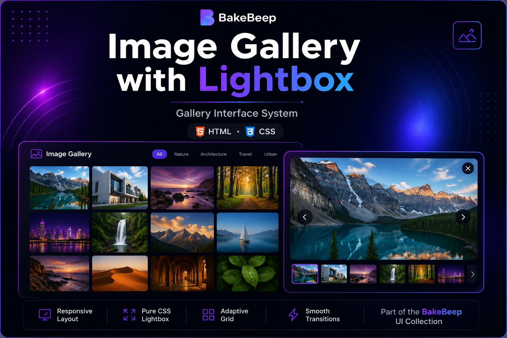
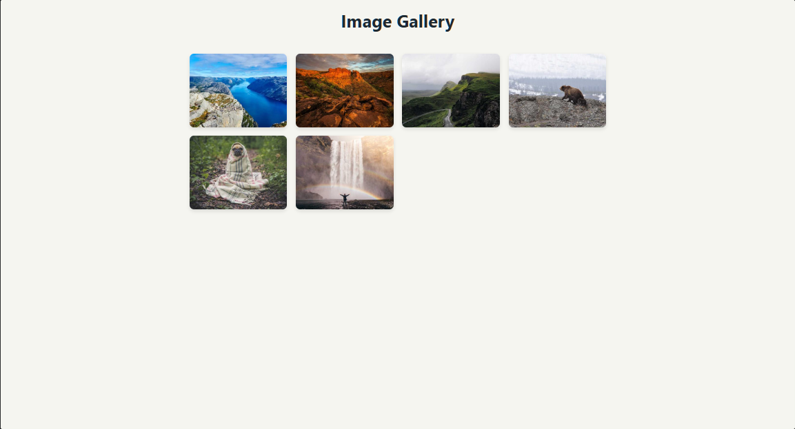
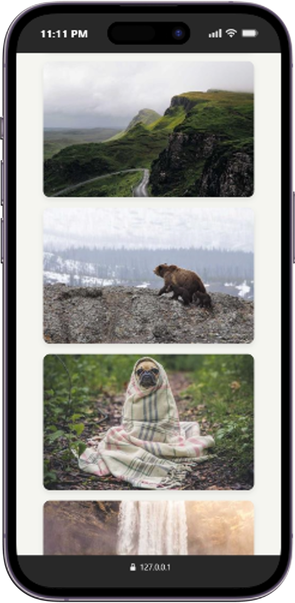

# Image Gallery with Lightbox

> A modern responsive image gallery built with HTML and CSS.




> **BakeBeep UI Collection**

This project is part of the **BakeBeep UI Collection**—a growing library of modern, reusable interface components and frontend patterns designed with performance, accessibility, and maintainability in mind.

---

## Overview

Image Gallery with Lightbox showcases a responsive gallery interface built entirely with HTML and CSS. It uses CSS Grid for adaptive layouts and the `:target` pseudo-class to create a JavaScript-free lightbox experience, allowing users to view images in an immersive overlay.

The project demonstrates how elegant image browsing experiences can be achieved using only core web technologies.

---

## Features

- Responsive image grid
- Pure CSS lightbox
- Previous/next navigation
- Close button
- Smooth transitions
- Adaptive layout
- Mobile-friendly design
- Semantic HTML

---

## Demo

🌐 **Live Demo:** _Paste your Vercel deployment URL here_

### Animated Preview


### Desktop



### Mobile



---

## Design Philosophy

The gallery emphasizes simplicity, visual clarity, and intuitive navigation. By relying solely on HTML and CSS, it demonstrates how lightweight interfaces can still deliver engaging user experiences.

---

## Technologies

- HTML5
- CSS3
- CSS Grid
- Flexbox
- CSS Transitions
- `:target` Pseudo-class
- Media Queries

---

## Folder Structure

```text
image-gallery/
│
├── assets/
├── css/
├── index.html
├── LICENSE
└── README.md
```

---

## Future Improvements

- Keyboard navigation
- Image captions
- Lazy loading
- Touch gestures
- Masonry layout
- Dark mode
- React version

---

## License

MIT License.

---

## About BakeBeep

BakeBeep is a software studio building modern web interfaces, reusable UI systems, and developer-focused digital products.

Every repository reflects our commitment to clean engineering, thoughtful design, accessibility, and continuous improvement.

Explore the BakeBeep UI Collection to discover more frontend projects.